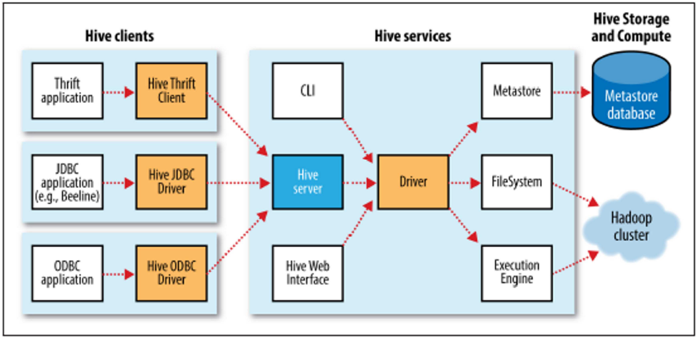

## Hive

### About Hive

- 하둡의 MapReduce는 복잡도가 높은 프로그래밍 기법이 필요
- 프로그래밍 기술이 없는 업무 분석가 및 관리자들이 빅데이터에 접근하는 것에 어려움
- 이를 해결하기 위해 페이스북 주도로 SQL과 매우 유사한 방식으로 하둡 데이터에 접근성을 높인 **하이브(Hive)**를 개발하여 공개
- 공식 홈페이지: http://hive.apache.org/


### Hive 주요 구성 요소

- CLI : 사용자가 Hive 쿼리를 입력하고 실행할 수 있는 인터페이스
- JDBC/ODBC 드라이버 : 하이브의 쿼리를 다양한 데이터베이스와 연결하기 위한 드라이버
- Query Engine : 사용자가 입력한 하이브 쿼리를 분석, 실행계획을 수립하고 하이브QL을 맵리듀스 코드로 변환하여 실행

### Hive Architecture



- 하이브 클라이언트에서 작성한 QL이 맵리듀스 프로그램을 전환되어 실행
- MetaStore : 
  - 하이브에서 사용하는 테이블의 스키마 정보를 저장 및 관리
  - 기본적으로는 Derby DB가 사용되지만 MySQL, PostgreSQL 등 다른 DBMS로 변경 가능
- Thrift API를 제공, 클라이언트 프로그램이 다양한 하이브 액션을 외부에서도 실행할 수 있게 해 줌

### Hive: Installation

#### 프로그램 다운로드 및 원하는 위치로 이동

```bash
wget https://dlcdn.apache.org/hive/hive-3.1.2/apache-hive-3.1.2-bin.tar.gz
tar zxvf apache-hive-3.1.2-bin.tar.gz
sudo mv apache-hive-3.1.2-bin /usr/local/hive
```

#### 실행 스크립트 수정(환경 설정)

- conf/hive-env.sh.template을 conf/hive-env.sh로 복사하여 사용

```bash
# in hive-env.sh
HADOOP_HOME=/usr/local/hadoop
```

#### 하이브 실행을 위한 환경 변수 설정

```bash
# in .bashrc
# Hive Setting
export HIVE_HOME=/usr/local/hive
export PATH=$HIVE_HOME/bin:$PATH
```

- 하이브 설정의 기본 값은 hive-default.xml.template에 정의
- 하이브 설정을 변경하려면 hive-site.xml을 정의해야 한다.

```bash
# in $HIVE_HOME/conf
cp hive-default.xml.template hive-default.xml
cp hive-default.xml hive-site.xml
# hive-site.xml 수정
```

```xml
<!-- in hive-site.xml -->
<?xml version="1.0" encoding="UTF-8" standalone="no"?>
<?xml-stylesheet type="text/xsl" href="configuration.xsl"?>
<configuration>
  <property>
    <name>hive.metastore.local</name>
    <value>false</value>
  </property>
  <property>
    <name>javax.jdo.option.ConnectionURL</name>
    <value>jdbc:mysql://localhost:3306/hive?createDatabaseIfNotExists=true&amp;useSSL=false&amp;allowPublicKeyRetrieval=true</value>
  </property>
  <property>
    <name>javax.jdo.option.ConnectionDriverName</name>
    <value>com.mysql.cj.jdbc.Driver</value>
  </property>
  <property>
    <name>javax.jdo.option.ConnectionUserName</name>
    <value>hive</value>
    <description>Username to use against metastore database</description>
  </property>
  <property>
    <name>javax.jdo.option.ConnectionPassword</name>
    <value>hive</value>
    <description>password to use against metastore database</description>
  </property>
  <property>
    <name>hive.cli.header</name>
    <value>true</value>
  </property>
</configuration>
```

- 하이브 메타스토어 접근을 위한 계정 생성
  - hive/hive


#### Hive 실행을 위한 필수 디렉터리를 HDFS에 생성 및 설정

- 하이브에서 업로드하는 데이터는 HDFS의 /user/hive/warehouse에 저장
- 하이브에서 실행하는 잡의 여유공간을 위한 /tmp/hive 디렉터리 필요

```bash
hdfs dfs -mkdir -p /user/hive/warehouse
hdfs dfs -mkdir -p /tmp/hive
hdfs dfs -chmod g+w /user/hive/warehouse
hdfs dfs -chmod 777 /tmp/hive
```
#### mysql connector 설정

- mysql.com > Download Connector/J
- 설치 후 jar 파일을 $HIVE_HOME/lib에 복사


```bash
sudo dpkg -i mysql-connector-java_8.0.27-1ubuntu20.04_all.deb
```

#### 메타스토어 초기화(Derby 사용시)

```bash
# in HIVE_HOME
./bin/schematool -initSchema -dbType derby
# hive 실행
./bin/hive
hive> show databases;
hive> quit;
```

#### 메타스토어 초기화(MySQL 사용시)

```bash
# in HIVE_HOME
./bin/schematool -initSchema -dbType mysql
# hive 실행
./bin/hive
hive> show databases;
hive> quit;
```

- 다음 에러 발생시 guava 버전 통일
```bash
# Exception Occured
Exception in thread "main" java.lang.NoSuchMethodError: 'void com.google.common.base.Preconditions.checkArgument(boolean, java.lang.String, java.lang.Object)'
```
- Solution:
```bash
mv lib/guava-19.0.jar lib/guava-19.0.jar.old
cp ../hadoop/share/hadoop/hdfs/lib/guava-27.0-jre.jar ./lib
```

#### 테스트 실행

```bash
# in HIVE_HOME
bin/hive
hive> show databases;
hive> quit;
```

#### 데이터베이스 관리

```bash
# 데이터베이스의 생성과 관리
create database <데이터베이스명>;
use <데이터베이스명>;
# 데이터베이스 삭제
drop database <데이터베이스명>;
# 데이터베이스 내 테이블 확인
show tables;
```

### HiveQL

- Hive는 HiveQL이라는 SQL과 매우 유사한 쿼리 언어를 제공
- 대부분의 기능은 SQL과 유사하지만 다음과 같은 차이점이 있음
  
  1.  하이브에서 사용하는 데이터가 HDFS에 저장되는데, HDFS가 한 번 저장한 파일은 수정할 수 없기 때문에 UPDATE와 DELETE를 사용할 수 없다.
  2. 같은 이유로 INSERT도 비어 있는 데이블에 입력하거나, 이미 입력된 데이터를 overwrite 하는 경우만 가능하다. 그래서 하이브는 INSERT OVERWRITE 라는 키워드를 사용한다.
  3. SQL은 어떠한 절에서도 서브쿼리를 사용할 수 있지만 HiveQL 은 FROM 절 에서만 서브 쿼리를 사용할 수 있다.
  4. SQL의 뷰는 업데이트할 수 있고, 구체화된 뷰 또는 인라인 뷰를 지원한다. 하지만 HiveQL의 뷰는 읽기 전용이며 인라인 뷰는 지원하지 않는다.
  5. SELECT 문을 사용할 때 HAVING 절을 사용할 수 없다.
  6. 저장 프로시저를 지원하지 않는다. 대신 맵리듀스 스크립트를 실행할 수 있다.


#### 테이블 생성

- 하둡은 HDFS에 저장된 파일에 직접 접근해서 처리하지만 하이브는 메타스토어에 저장된 테이블을 분석
- 데이터를 조회하기 전에 먼저 테이블을 생성해야 함
- Hive의 테이블은 크게 두 가지로 구분
  - 내부 테이블: 
    - hive.metastore.warehouse.dir 속성이 가리키는 디렉터리에 데이터가 저장
  - 외부 테이블:
    - EXTERNAL 키워드로 생성하는 테이블(테이블 생성시 LOCATION 키워드로 데이터의 경로를 지정)
    - 실수로 테이블을 삭제해도 데이터는 제거되지 않음


#### CREATE TABLE 문 사용

  - ROW FORMAT 절을 제외하면 SQL과 매우 유사
  - CREATE EXTERNAL TABLE을 사용하면 외부 테이블 생성 가능
    - 외부 테이블은 테이블을 DROP 해도 데이터가 보관된다는 장점

```sql
-- 기본 문법
CREATE EXTERNAL TABLE airline(
    YEAR INT,
    MONTH INT,
    DAY_OF_MONTH INT,
    DAY_OF_WEEK INT,
    FL_DATE DATE,
    UNIQUE_CARRIER STRING,
    TAIL_NUM STRING,
    FL_NUM STRING,
    ORIGIN_AIRPORT_ID STRING,
    ORIGIN STRING,
    ORIGIN_STATE_ABR STRING,
    DEST_AIRPORT_ID STRING,
    DEST STRING,
    DEST_STATE_ABR STRING,
    CRS_DEP_TIME INT,
    DEP_TIME FLOAT,
    DEP_DELAY FLOAT,
    DEP_DELAY_NEW FLOAT,
    DEP_DEL15 STRING,
    DEP_DELAY_GROUP STRING,
    TAXI_OUT INT,
    WHEELS_OFF INT,
    WHEELS_ON INT,
    TAXI_IN INT,
    CRS_ARR_TIME INT,
    ARR_TIME FLOAT,
    ARR_DELAY FLOAT,
    ARR_DELAY_NEW FLOAT,
    ARR_DEL15 STRING,
    ARR_DELAY_GROUP STRING,
    CANCELLED STRING,
    CANCELLATION_CODE STRING,
    DIVERTED STRING,
    CRS_ELAPSED_TIME INT,
    ACTUAL_ELAPSED_TIME INT,
    AIR_TIME INT,
    FLIGHTS INT, 
    DISTANCE INT,
    DISTANCE_GROUP STRING,
    CARRIER_DELAY INT,
    WEATHER_DELAY INT,
    NAS_DELAY INT,
    SECURITY_DELAY INT,
    LATE_AIRCRAFT_DELAY INT
)
COMMENT 'airline csv data'
ROW FORMAT DELIMITED
    FIELDS TERMINATED BY ','
    LINES TERMINATED BY '\n'
    STORED AS TEXTFILE
LOCATION '/user/hadoop/input';

-- 테이블 구조 확인
DESCRIBE airline;
SELECT * FROM airline limit 10;
-- 이 테이블의 문제는 무엇입니까?

-- SERDE를 이용한 고급 문법
CREATE EXTERNAL TABLE airline(
    YEAR INT,
    MONTH INT,
    DAY_OF_MONTH INT,
    DAY_OF_WEEK INT,
    FL_DATE DATE,
    UNIQUE_CARRIER STRING,
    TAIL_NUM STRING,
    FL_NUM STRING,
    ORIGIN_AIRPORT_ID STRING,
    ORIGIN STRING,
    ORIGIN_STATE_ABR STRING,
    DEST_AIRPORT_ID STRING,
    DEST STRING,
    DEST_STATE_ABR STRING,
    CRS_DEP_TIME INT,
    DEP_TIME FLOAT,
    DEP_DELAY FLOAT,
    DEP_DELAY_NEW FLOAT,
    DEP_DEL15 STRING,
    DEP_DELAY_GROUP STRING,
    TAXI_OUT INT,
    WHEELS_OFF INT,
    WHEELS_ON INT,
    TAXI_IN INT,
    CRS_ARR_TIME INT,
    ARR_TIME FLOAT,
    ARR_DELAY FLOAT,
    ARR_DELAY_NEW FLOAT,
    ARR_DEL15 STRING,
    ARR_DELAY_GROUP STRING,
    CANCELLED STRING,
    CANCELLATION_CODE STRING,
    DIVERTED STRING,
    CRS_ELAPSED_TIME INT,
    ACTUAL_ELAPSED_TIME INT,
    AIR_TIME INT,
    FLIGHTS INT, 
    DISTANCE INT,
    DISTANCE_GROUP STRING,
    CARRIER_DELAY INT,
    WEATHER_DELAY INT,
    NAS_DELAY INT,
    SECURITY_DELAY INT,
    LATE_AIRCRAFT_DELAY INT
)
COMMENT 'airline csv data'
ROW FORMAT SERDE 'org.apache.hadoop.hive.serde2.OpenCSVSerde'
WITH SERDEPROPERTIES(
    "separatorChar" = ",",
    "quoteChar" = "\""
)
LOCATION '/user/hadoop/input'
tblproperties('skip.header.line.count'='1');

-- 이 방식의 장점과 단점은 무엇입니까?

DESCRIBE airline;
SELECT * FROM airline LIMIT 10;
```

#### 실습을 위한 airline_delay 테이블 생성

```sql
CREATE TABLE airline_delay(
  YEAR INT, 
  MONTH INT, 
  DAY_OF_MONTH INT, 
  DAY_OF_WEEK INT, 
  FL_DATE STRING, 
  UNIQUE_CARRIER STRING, 
  TAIL_NUM STRING, 
  FL_NUM INT,
  ORIGIN_AIRPORT_ID INT, 
  ORIGIN STRING, 
  ORIGIN_STATE_ABR STRING, 
  DEST_AIRPORT_ID INT, 
  DEST STRING, 
  DEST_STATE_ABR STRING, 
  CRS_DEP_TIME INT, 
  DEP_TIME INT, 
  DEP_DELAY INT, 
  DEP_DELAY_NEW INT, 
  DEP_DEL15 INT, 
  DEP_DELAY_GROUP INT, 
  TAXI_OUT INT,
  WHEELS_OFF STRING, 
  WHEELS_ON STRING, 
  TAXI_IN INT, 
  CRS_ARR_TIME INT, 
  ARR_TIME INT,
  ARR_DELAY INT, 
  ARR_DELAY_NEW INT, 
  ARR_DEL15 INT, 
  ARR_DELAY_GROUP INT, 
  CANCELLED INT, 
  CANCELLATION_CODE STRING, 
  DIVERTED INT, CRS_ELAPSED_TIME INT,
  ACTUAL_ELAPSED_TIME INT, 
  AIR_TIME INT, 
  FLIGHTS INT, 
  DISTANCE INT, 
  DISTANCE_GROUP INT, 
  CARRIER_DELAY STRING, 
  WEATHER_DELAY STRING, 
  NAS_DELAY STRING,
  SECURITY_DELAY STRING, 
  LATE_AIRCRAFT_DELAY STRING)
PARTITIONED BY (delayYear INT)
ROW FORMAT DELIMITED
  FIELDS TERMINATED BY ','
  LINES TERMINATED BY '\n'
STORED AS TEXTFILE
tblproperties('skip.header.line.count'='1');
```

#### 데이터 업로드

- 하이브는 로컬 파일시스템에 있는 데이터와 HDFS에 저장된 데이터 모두 업로드 할 수 있음
- ** HDFS의 데이터 로드 시 LOCAL 만 빼면 됨

```sql
-- 2008년 항공 데이터를 파티션을 나누어 저장
LOAD DATA LOCAL INPATH '/home/hadoop/datasets/AirOnTimeCSV/airOT2008*.csv'
INTO TABLE airline_delay
PARTITION (delayYear=2008);
```

- hive 내부 테이블의 데이터는 /user/hive/warehouse/ 폴더에 저장됨.
  - hdfs 명령으로 확인해 봅시다.

- 연습: 2007년 항공 데이터를 delayYear=2007 파티션에 분할 저장해 봅시다.

#### 파티션 기준 데이터 삭제

```sql
ALTER TABLE airline_delay 
DROP PARTITION (delayYear=2007);
```

- hdfs 명령으로 파티션 정보를 확인해 봅시다.

#### HiveQL을 이용한 SELECT

- SELECT 문은 SQL과 거의 유사
- 질의를 실행하면 맵리듀스 잡을 실행
- 최근 버전의 하이브는 LIMIT 조건으로 테이블을 조회하면 파일을 직접 조회하여 출력(즉시 출력)
  
```sql
-- 기본적인 SELECT
SELECT * FROM airline_delay 
WHERE year=2008 LIMIT 10;

-- 주요 컬럼 SELECTION
SELECT year, month, day_of_month, day_of_week, fl_date, 
  unique_carrier, tail_num, fl_num,
  origin_airport_id, origin, origin_state_abr,
  dest_airport_id, dest, dest_state_abr, 
  crs_dep_time, dep_time, dep_delay, arr_delay
FROM airline_delay
WHERE delayYear='2008'
LIMIT 20;
```

#### 집계 함수

| 집계 함수 | 설명 |
| :--- | :--- |
| COUNT(1), COUNT(*) | 전체 데이터의 건수를 반환 |
| COUNT(DISTINCT 컬럼) | 유일한 컬럼 값의 건수를 반환 |
| SUM(컬럼) | 컬럼 값의 합계를 반환 |
| SUM(DISTINCT 컬럼) | 유일한 컬럼 값의 합계 반환 |
| AVG(컬럼) | 컬럼 값의 평균 반환 |
| AVG(DISTINCT 컬럼) | 유일한 컬럼 값의 평균 반환 |
| MIN(컬럼) | 최솟값 |
| MAX(컬럼) | 최댓값 |

##### COUNT
```SQL
-- 2008년 항공 데이터 전체 카운트
SELECT COUNT(*) 
FROM airline_delay 
WHERE delayYear='2008';
```

- GROUP BY, ORDER BY도 가능

```SQL
SELECT year, month, count(*) AS arrive_delay_count
FROM airline_delay
WHERE arr_delay > 0
GROUP BY year, month
ORDER BY year, month;
```

##### AVG

```sql
-- 평균 도착 지연 시간, 평균 출발 지연 시간 쿼리
SELECT year, month, AVG(arr_delay) AS arrive_delay_avg, AVG(dep_delay) AS dep_delay_avg
FROM airline_delay
WHERE arr_delay > 0 OR dep_delay > 0
GROUP BY year, month
ORDER BY year, month;
```

#### JOIN

- Hive는 Equi-Join만 지원
- JOIN 테스트를 위한 테이블 생성

```sql
-- 항공사 정보 테이블 생성
CREATE TABLE carrier_code(
  code STRING, description STRING
)
ROW FORMAT DELIMITED
FIELDS TERMINATED BY ','
LINES TERMINATED BY '\n'
STORED AS TEXTFILE
tblproperties('skip.header.line.count'='1');

-- 항공기 데이터 로드
LOAD DATA LOCAL INPATH '/home/hadoop/datasets/carriers.csv'
INTO TABLE carrier_code;
```

- EQUI-JOIN 연습

```sql
-- airline_delay 테이블에서 도착 지연 시간 컬럼을 조회
SELECT year, month, unique_carrier, arr_delay 
FROM airline_delay LIMIT 10;

-- carrier_code 테이블에서 항공사 코드와 설명을 조회
SELECT code, description 
FROM carrier_code WHERE code='"9E"';

-- airline_delay.unique_carrier와 carrier_code.code를 조인
SELECT a.year, a.unique_carrier, b.description, count(*)
FROM airline_delay a JOIN carrier_code b
  ON a.unique_carrier=b.code
WHERE a.arr_delay > 0
GROUP BY a.year, a.unique_carrier, b.description;
```

#### INSERT (결과를 HDFS로 덤프)

```SQL
-- 도착 지연시간 통계를 HDFS로 덤프
INSERT OVERWRITE DIRECTORY 'output/hive_dept_delay'
ROW FORMAT DELIMITED FIELDS TERMINATED BY ',' 
  SELECT year, month, count(*) 
  FROM airline_delay
  WHERE dep_delay > 0 
  GROUP BY year, month 
  ORDER BY year, month;
```