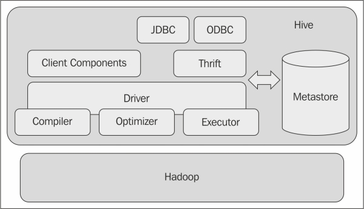

## Hive

### About Hive

- 하둡의 MapReduce는 복잡도가 높은 프로그래밍 기법이 필요
- 프로그래밍 기술이 없는 업무 분석가 및 관리자들이 빅데이터에 접근하는 것에 어려움
- 이를 해결하기 위해 페이스북 주도로 SQL과 매우 유사한 방식으로 하둡 데이터에 접근성을 높인 **하이브(Hive)**를 개발하여 공개
- 공식 홈페이지: http://hive.apache.org/


### Hive 주요 구성 요소

- CLI : 사용자가 Hive 쿼리를 입력하고 실행할 수 있는 인터페이스
- JDBC/ODBC 드라이버 : 하이브의 쿼리를 다양한 데이터베이스와 연결하기 위한 드라이버
- Query Engine : 사용자가 입력한 하이브 쿼리를 분석, 실행계획을 수립하고 하이브QL을 맵리듀스 코드로 변환하여 실행

### Hive Architecture



- 하이브 클라이언트에서 작성한 QL이 맵리듀스 프로그램을 전환되어 실행
- MetaStore : 
  - 하이브에서 사용하는 테이블의 스키마 정보를 저장 및 관리
  - 기본적으로는 Derby DB가 사용되지만 MySQL, PostgreSQL 등 다른 DBMS로 변경 가능
- Thrift API를 제공, 클라이언트 프로그램이 다양한 하이브 액션을 외부에서도 실행할 수 있게 해 줌

### Hive: Installation

#### 프로그램 다운로드 및 원하는 위치로 이동

```bash
wget https://downloads.apache.org/hive/hive-2.3.7/apache-hive-2.3.7-bin.tar.gz
tar zxvf apache-hive-2.3.7-bin.tar.gz
sudo mv apache-hive-2.3.7-bin /usr/local/hadoop
```

#### 실행 스크립트 수정

- conf/hive-env.sh.template을 conf/hive-env.sh로 복사하여 사용

```bash
# in hive-env.sh
HADOOP_HOME=/usr/local/hadoop
```

#### 하이브 실행을 위한 환경 변수 설정

```bash
# in .bashrc
# Hive Setting
export HIVE_HOME=/usr/local/hive
export PATH=$HIVE_HOME/bin:$PATH
```

#### Hive 실행을 위한 필수 디렉터리를 HDFS에 생성 및 설정

- 하이브에서 업로드하는 데이터는 HDFS의 /user/hive/warehouse에 저장
- 하이브에서 실행하는 잡의 여유공간을 위한 /tmp/hive 디렉터리 필요

```bash
hdfs dfs -mkdir -p /user/hive/warehouse
hdfs dfs -mkdir -p /tmp/hive
hdfs dfs -chmod g+w /user/hive/warehouse
hdfs dfs -chmod 777 /tmp/hive
```

#### 메타스토어 초기화

```bash
# in HIVE_HOME
./bin/schematool -initSchema -dbType derby
# hive 실행
./bin/hive
hive> show databases;
hive> quit;
```