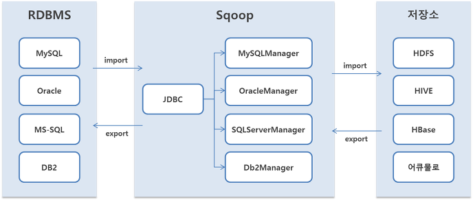

## Sqoop

### About Sqoop

- RDBMS와 HDFS 사이에서 데이터를 편리하게 불러오거나 내보내주는 소프트웨어

### Sqoop 주요 구성 요소

- Sqoop Client : 하둡의 분산 환경에서 HDFS와 RDBMS 간의 데이터 임포트 및 익스포트 기능을 수행하기 위한 라이브러리
- Import/Export : 임포트 기능은 RDBMS의 데이터를 HDFS로 가져올 때 사용하며, 익스포트 기능은 HDFS의 데이터를 RDBMS로 내보낼 때 사용
- Connectors : 임포트 및 익스포트에서 사용될 다양한 DBMS의 접속 어댑터와 라이브러리

### Sqoop Architecture



### Sqoop Installation

#### 프로그램 다운로드 및 원하는 위치로 이동

```bash
# 다운로드 sqoop
wget https://downloads.apache.org/sqoop/1.4.7/sqoop-1.4.7.bin__hadoop-2.6.0.tar.gz
# 압축 해제
tar zxvf sqoop-1.4.7.bin__hadoop-2.6.0.tar.gz
# 이동
sudo mv sqoop-1.4.7.bin__hadoop-2.6.0 /usr/local/sqoop
```

#### 환경 변수 등록

```bash
# in .bashrc
# Sqoop Setting
export SQOOP_HOME=/usr/local/sqoop
export PATH=$SQOOP_HOME/bin:$PATH
```

