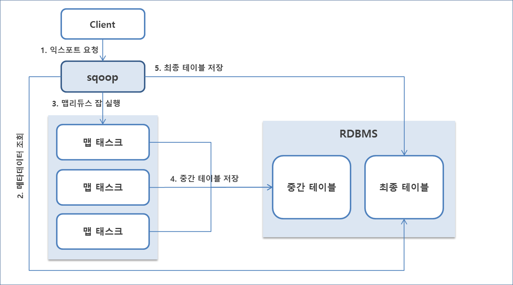

## Sqoop

### About Sqoop

- 구조화된 관계형 데이터베이스와 아파치 하둡간의 대용량 데이터들을 효율적으로 변환하여 주는 명령 줄 인터페이스(Command-Line Interface) 애플리케이션
- 오라클 또는 MySQL 같은 관계형 데이터페이스에서 하둡 분산 파일 시스템으로 데이터들을 가져와서 하둡 맵리듀스로 변환하고, 그 변환된 데이터들을 다시 관계형 데이터베이스로 내보낼 수 있음
- 스쿱은 데이터의 가져오기와 내보내기를 맵리듀스를 통해 처리하여 장애 허용 능력 뿐만 아니라 병렬 처리가 가능하게 함

### Sqoop 주요 구성 요소

- Sqoop Client : 하둡의 분산 환경에서 HDFS와 RDBMS 간의 데이터 임포트 및 익스포트 기능을 수행하기 위한 라이브러리
- Import/Export : 임포트 기능은 RDBMS의 데이터를 HDFS로 가져올 때 사용하며, 익스포트 기능은 HDFS의 데이터를 RDBMS로 내보낼 때 사용
- Connectors : 임포트 및 익스포트에서 사용될 다양한 DBMS의 접속 어댑터와 라이브러리

### Sqoop Architecture


#### 데이터 임포트 동작 방식


#### 데이터 익스포트 동작 방식



### Sqoop Installation

#### 프로그램 다운로드 및 원하는 위치로 이동

```bash
# 다운로드 sqoop
wget https://downloads.apache.org/sqoop/1.4.7/sqoop-1.4.7.bin__hadoop-2.6.0.tar.gz
# 압축 해제
tar zxvf sqoop-1.4.7.bin__hadoop-2.6.0.tar.gz
# 이동
sudo mv sqoop-1.4.7.bin__hadoop-2.6.0 /usr/local/sqoop
```

#### 환경 변수 등록

```bash
# in .bashrc
# Sqoop Setting
export SQOOP_HOME=/usr/local/sqoop
export PATH=$SQOOP_HOME/bin:$PATH
```

#### SQOOP 환경 설정

- $SQOOP_HOME/conf의 sqoop-env-template.sh를 $SQOOP_HOME/conf/sqoop-env.sh로 복사하여 사용

##### 환경 설정
```bash
# in conf/sqoop-env.sh
#Set path to where bin/hadoop is available
export HADOOP_COMMON_HOME=$HADOOP_HOME

#Set path to where hadoop-*-core.jar is available
export HADOOP_MAPRED_HOME=$HADOOP_HOME
```

##### mysql connector 설치

- 기존에 설치한 mysql connector를 sqoop/lib 디렉터리로 복사

##### 실행

```bash
bin/sqoop
# help로 간략한 사용법을 확인해 봅시다.
```

#### 데이터 임포트(import)

##### NATION 테이블 임포트

1. 임포트 테스트

```bash
bin/sqoop import 
    --username hadoop 
    --password hadoop 
    --connect jdbc:mysql://localhost:3306/tpch_1g --table nation
```

* [TROUBLE SHOOTING]
```bash 
Exception in thread "main" java.lang.NoClassDefFoundError: org/apache/commons/lang/StringUtils
```
* [SOLUTION]
  * commons-lang-2.6.jar 파일 필요
  * mvnrepository에서 jar 파일을 검색, sqoop/lib 디렉터리에 복사

* [TROUBLE SHOOTING]
```bash
ERROR tool.ImportTool: Import failed: No primary key could be found for table nation. Please specify one with --split-by or perform a sequential import with '-m 1'.
```
* [SOLUTION]
  * 스쿱은 기본적으로 Primary Key 값을 기준으로 조회 후 질의문을 생성
  * nation 테이블은 키본 키가 없어서 발생한 에러
  * --split-by 옵션으로 키본키를 대신할 키를 생성하거나 
  * 하나의 맵 태스크만 실행하도록 -m 옵션을 1로 설정

```bash
bin/sqoop import 
    --username hadoop 
    --password hadoop 
    --connect jdbc:mysql://localhost:3306/tpch_1g --table nation
    --split-by n_regionkey 
```

* import시 컬럼을 명시적으로 지정하지 않으면 알파멧 순서대로 import
* 추출할 컬럼을 명시하려면 --columns 옵션에 컬럼을 ,로 구분하여 지정
  * (예) --columns "n_nationkey, n_name"
* 특정 조건을 만족하는 레코드만 임포트할 경우 --where 옵션에 지정
  * (예) --where "n_regionkey = 1"

##### 결과 확인

```bash
hdfs dfs -ls nation
# hdfs에 저장된 결과를 mysql의 실제 레코드와 비교해 봅시다.
```

#### 스쿱 스크립트 작성
- 커맨드 라인을 이용해 스쿱을 실행하는 것보다 스크립트를 만들어 두고 옵션을 조정하는 것이 더 효율적
- 일반적으로 scripts 디렉터리를 생성해 두고 내부에 스크립트를 관리

```bash
# in scripts/nation-import.sh
--username
hadoop
--password
hadoop
--connect
jdbc:mysql://localhost:3306/tpch_1g
--table
nation
--split-by
n_regionkey
-m
1
```

##### 스크립트 실행

```bash
bin/sqoop import --options-file scripts/nation-import.sh
# 수행 후 결과를 조회해 봅시다.
```

##### [연습] 스크립트 작성

- tpch_1g 데이터베이스에는 nation 테이블 이외에도 여러 개의 테이블이 존재합니다.
- 해당 테이블의 데이터를 HDFS로 가져오는 스크립트를 작성해 봅시다.

#### 데이터 내보내기(EXPORT)

- HDFS에 저장된 데이터를 다른 데이터베이스로 내보내는 것

1) HDFS 데이터를 MySQL로 내보내기 위해 결과 테이블과 Staging 테이블 (중간 결과 임시 저장용)을 생성

```sql
-- 최종 결과 테이블을 생성
create table carrier_code(code TEXT, description TEXT);

-- 중간 결과 테이블을 생성
create table carrier_code_staging(code TEXT, description TEXT);
```

2) hdfs에 carriers.csv 파일 업로드

```bash
hdfs dfs -mkdir carrier_code
hdfs dfs -put carriers.csv carrier_code
```

3) 스크립트 작성

```bash
# in scripts/carrier-export.sh
--username
hadoop
--password
hadoop
--connect
jdbc:mysql://localhost:3306/tpch_1g
--table
carrier_code
--staging-table
carrier_code_staging
--clear-staging-table
--input-fields-terminated-by
,
--export-dir
carrier_code
-m
1
```

4) Export
```bash
bin/sqoop export --options-file scripts/carrier-export.sh
```

* MySQL로 가서 결과 테이블을 확인해 봅시다.
  